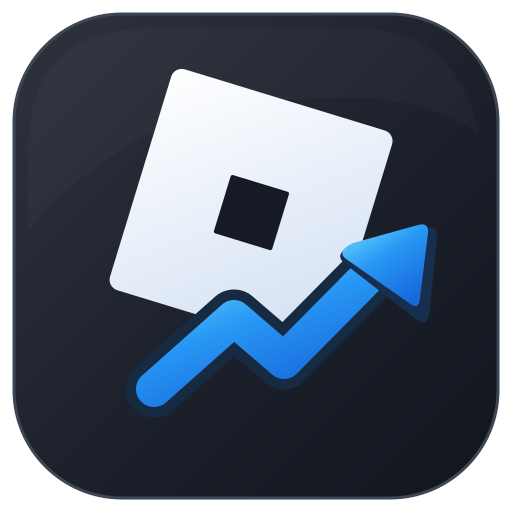

# Roblox Price Tracker



A Windows app for monitoring Roblox Limited resale prices, finding qualifying UGC Limited drops, and getting price alerts. Built by [3AYZE](https://github.com/3AYZE).

**[Download RobloxPriceTracker.exe](https://github.com/3AYZE/Roblox-Price-Tracker/releases/download/latest/RobloxPriceTracker.exe)** · [Current release](https://github.com/3AYZE/Roblox-Price-Tracker/releases/tag/latest)

Requires **Windows 10/11 (64-bit)** and the [.NET 9 Desktop Runtime](https://dotnet.microsoft.com/en-us/download/dotnet/9.0).

## Features

- **Tracker:** Follow Limited resale prices, set targets, inspect price history, and receive alerts.
- **UGC Hunter:** Scan eligible, catalog-purchasable UGC Limiteds at the app's current 95 R$ primary-price setting. View supply, momentum, resale evidence, and modeled risk.
- **Research:** Explore charts, Roblox market data where available, and historical trends.
- **Paper Portfolio:** Test ideas with simulated positions—no Robux spent.
- **Background monitoring:** Keep tracking in the system tray, optionally start with Windows, and export or back up local data.

Forecasts and opportunity scores are estimates, not guarantees. Primary catalog prices and resale prices are tracked separately.

## Updates

There is **one current Windows EXE**. The app checks the [permanent Latest release](https://github.com/3AYZE/Roblox-Price-Tracker/releases/tag/latest) for updates, downloads a newer build, checks GitHub's SHA-256 asset digest, then offers to restart and install it. No separate checksum download or manual reinstall is needed.

Existing users of older versions can migrate through the retained compatibility release. These older files are not intended for new installations.

## Privacy and your data

The app uses public Roblox market data. It does **not** require your Roblox login, collect a `.ROBLOSECURITY` cookie, or automatically buy or sell items.

Saved items, alerts, history, portfolio, settings, and backups are kept separately from the EXE at:

```text
%LOCALAPPDATA%\RobloxPriceTracker
```

Updates do not intentionally replace this folder. You can also export a backup from the app.

## Build from source

Install the [.NET 9 SDK](https://dotnet.microsoft.com/en-us/download/dotnet/9.0) on Windows, then run `BUILD WINDOWS.bat`. The build runs the regression suite and produces `dist\RobloxPriceTracker.exe`.

Developers: [Architecture](docs/ARCHITECTURE.md) · [Changelog](docs/CHANGELOG.md)
